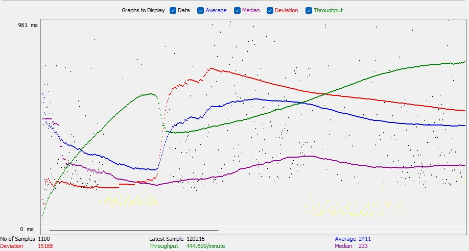
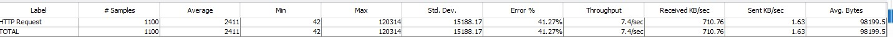

# QACourse2MidTerm - Part Three

## Performance Testing

**Testing Microsoft.com**

Microsoft's site was considerably slower to load compared to other large technology companies. The load time did level out and maintain a consistent experience. This indicates Microsoft's site is able to handle large volumes of users without causing negative performance. However, the number of errors rose considerably after the first 10 seconds, leveling out at around a 40% error rate. I believe this was due to Microsoft blocking the requests as they were all a 403 forbidden error.

